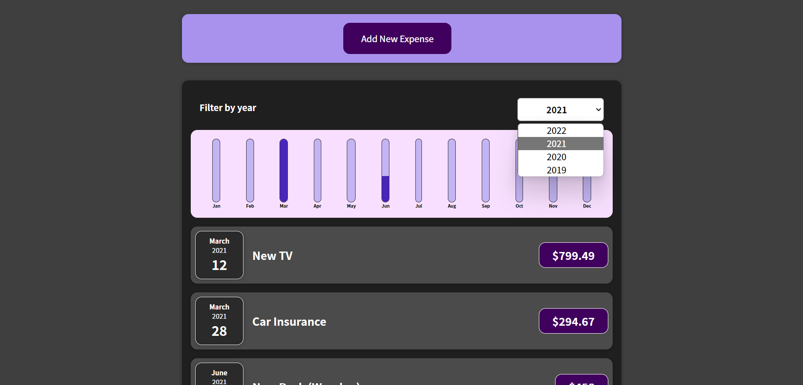

# Expense Tracker

Welcome to Expense Tracker, a single-page web application that helps you keep track of your expenses. With this application, you can add expenses, select dates, and view your expenses in a beautiful chart display.

## Installation

To run the project, please clone the repository using the following command:

`git clone https://github.com/khaled-farahat/Expenses-Tracker.git`

Then, navigate to the project directory and run the following commands to install the dependencies:

`npm install`

`npm start`

After the dependencies are installed, you can access the application by navigating to `http://localhost:3000/` in your web browser.

## Usage

On the main page of the application, you can view your expenses in a chart display.

To add an expense, click on the "Add Expense" button. This will open a form where you can enter the title, date, and cost of your expense.

Once you've entered your expense information, click on the "Add Expense" button to save your expense.

And you can see choose the year that you want to see your expanses at

# 

## License

This project is licensed under the MIT License - see the [LICENSE](LICENSE) file for details.
